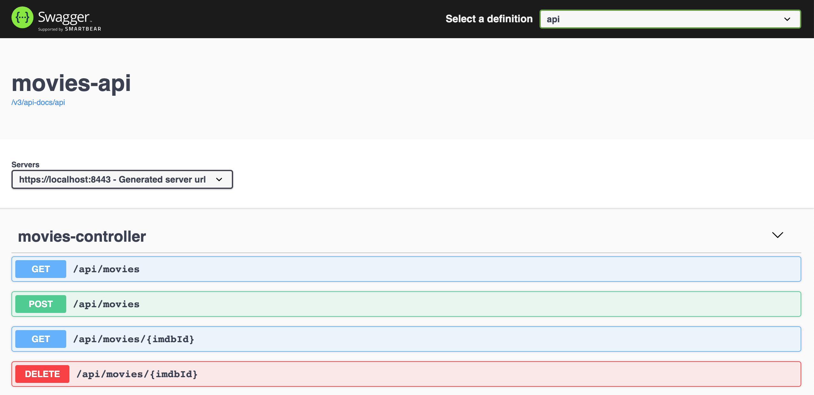
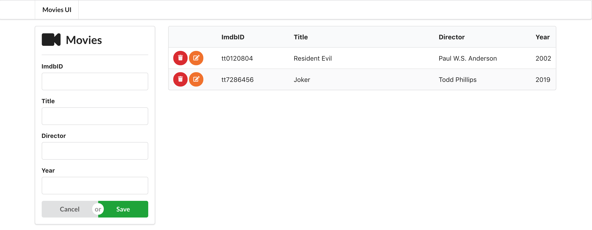

# https-springboot-react

The goal of this project is to play with [`HTTPS`](https://en.wikipedia.org/wiki/HTTPS) and enable it in [`Spring Boot`](https://docs.spring.io/spring-boot/docs/current/reference/htmlsingle/) applications. For it, we will implement a `Spring Boot` Rest API, called `movies-api` that will have its endpoints ready to accept and server over `HTTPS`. Furthermore, a `Spring Boot Shell` Java application, called `movies-shell`, and a Frontend [`ReactJS`](https://reactjs.org/) application, called `movies-ui`, will be implemented to consume `movies-api`.

## Applications

- ### movies-api

  `Spring Boot` Web Java application that exposes a Rest API to manage movies. Its endpoints are ready to accept and server over `HTTPS`. `movies-api` stores its data in [`H2`](https://www.h2database.com/html/main.html) memory database.

- ### movies-shell

  `Spring Boot` Shell Java application that uses `movies-api` to get information about a movie or to even add/delete a movie. All the communication with `movies-api` is over `HTTPS`.

- ### movies-ui

  `ReactJS` frontend application where users can manage movies. All the communication with `movies-api` is over `HTTPS`. It uses [`Semantic UI React`](https://react.semantic-ui.com/) as CSS-styled framework.

## Prerequisites

- [`npm`](https://www.npmjs.com/get-npm)
- [`Java 11+`](https://www.oracle.com/java/technologies/javase-jdk11-downloads.html)

## Start applications

- **movies-api**

  - Open a terminal and inside `https-springboot-react/movies-api` folder run
    ```
    ./mvnw clean spring-boot:run
    ```

  - Its Swagger website is https://localhost:8443/swagger-ui.html

    

- **movies-shell**

  - Open another terminal and inside `https-springboot-react/movies-shell` folder run the command below to package the `jar`
    ```
    ./mvnw clean package -DskipTests
    ```

  - Still inside `https-springboot-react/movies-shell`, run the following command to start `movies-shell`
    ```
    ./target/movies-shell-0.0.1-SNAPSHOT.jar
    ```

  - Sample of the shell interface and execution

    

- **movies-ui**

  - Open another terminal and go to `https-springboot-react/movies-ui` folder

  - Execute the command below if you are running it for the first time
    ```
    npm install
    ```

  - To start `movies-ui` run
    ```
    npm start
    ```

  - The url is https://localhost:3443

    

## Create PKCS12 self-signed certificate

- In order to create a [`PKCS12`](https://en.wikipedia.org/wiki/PKCS_12) certificate, run the following command
  ```
  keytool -genkeypair -alias localhost \
    -keyalg RSA -keysize 2048 -storetype PKCS12 \
    -keystore keystore.p12 -validity 3650 \
    -dname "CN=localhost, OU=MyCompany, O=MyCompany, L=Berlin, ST=Berlin, C=DE"
  ```

- Set a password. In this project, we will use `secret`
  ```
  Enter keystore password: secret
  Re-enter new password: secret
  ```

- To list the certificates `keystore.p12` run the command below. The password will be requested.
  ```
  keytool -list -v -keystore keystore.p12
  ```

## How to upgrade movies-ui dependencies to latest version

- In a terminal, make sure you are inside `https-springboot-react/movies-ui` folder

- Run the following commands
  ```
  npm i -g npm-check-updates
  ncu -u
  npm install
  ```

## References

- https://www.javadevjournal.com/spring-boot/spring-boot-ssl/
- https://www.baeldung.com/spring-boot-https-self-signed-certificate
- https://www.thomasvitale.com/https-spring-boot-ssl-certificate/
- https://medium.com/@danielgwilson/https-and-create-react-app-3a30ed31c904